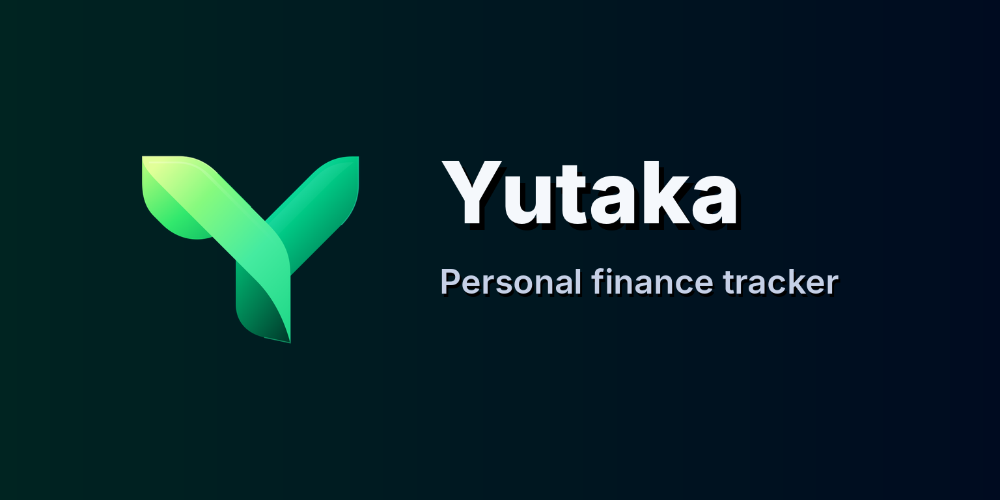

<p align="center">
  
</p>

# Yutaka

<p align="center">
  <a href="https://flutter.dev"></a>
  <a href="https://github.com/Chowdhury-Siam/Yutaka/actions/workflows/build-android-apks.yml"></a>
  
  <a href="LICENSE"></a>
</p>

<p align="center">
  A private, local-first personal finance app for Android, Windows, Linux, and macOS.<br>
  Use it completely offline, or connect your own Cloudflare Worker for optional multi-device sync.
</p>

## Quick navigation

| Start here | Self-hosted sync | App & backups | Developers |
| --- | --- | --- | --- |
| [1. What is Yutaka?](#what-is-yutaka)<br>[2. Features](#features)<br>[3. Getting started](#getting-started) | [4. What self-hosted sync means](#optional-self-hosted-sync)<br>[5. Deploy your Worker](#deploy-your-self-hosted-worker)<br>[6. Connect Yutaka](#connect-yutaka-to-your-worker)<br>[Administration portal](#worker-administration-portal)<br>[7. Credentials & Archive](#optional-telegram-cloud-backup) | [8. Local](#local-backup)<br>[9. Data safety](#data-safety-and-security)<br>[12. Troubleshooting](#troubleshooting) | [10. Build from source](#build-from-source)<br>[11. Worker development](#worker-development)<br>[13. Project structure](#project-structure)<br>[14. License](#license) |

---

<a id="what-is-yutaka"></a>
## 1. What is Yutaka?

Yutaka is a personal finance tracker designed to keep your data under your control.
Your accounts, transactions, categories, budgets, loans, plans, subscriptions, and other finance data are saved to a local SQLite database first.

You **do not need an account or server to use Yutaka**. Install the app, choose **Use offline**, and start tracking your money.

If you want the same data on multiple devices, Yutaka also supports **self-hosted sync**. You create a small Cloudflare Worker connected to your own Turso database, then enter the Worker URL in the app.

### 1.1 In simple terms

- **Yutaka app** = the finance app on your phone or PC.
- **Cloudflare Worker** = your small private sync server.
- **Turso** = the database used by that sync server.
- **GitHub Actions** = automatically deploys the Worker for you.

You do not need to write Cloudflare or Turso code yourself.

<a id="features"></a>
## 2. Features

### 2.1 Personal finance

- Multiple cash, bank, card, savings, and custom accounts
- Income, expense, and transfer transactions
- Combined Time • Date transaction control with optional date/time ranges and the selected values visible on the main form
- Configurable transaction service charges by fixed number or percentage (off by default), with the selected charge shown on the main form and percentage previews updated as the amount changes
- Persistent transaction sorting by newest/oldest date and time, category, amount, or title
- Single dates/times or optional start/end ranges
- Custom income and expense categories
- Monthly budgets and progress tracking
- Lending and borrowing with repayments, interest, due dates, and timestamps
- Purchase planning with item name, expected price, category, optional date/time reminders, total planned cost, editing, and one-tap purchase conversion
- Recurring subscriptions with scheduled date/time, price, category, spending account, daily/weekly/monthly/yearly repeat, automatic transaction recording, and manual “Add now”
- Cash-flow trends, category analysis, balances, and net results
- Analytics summaries driven by the same **Choose Date Filter** flow used elsewhere in Yutaka: Today, This Week, This Month, This Year, All Time, or a Custom date range
- Analytics reports support **PDF**, **XLSX**, and **TXT** in both Summary and Transaction history variants, with direct and scheduled Self-Hosted Worker uploads to Telegram and Google Drive
- Search and filters for account, category, type, and date
- Quick account/category creation from transaction pickers

### 2.2 Backup and restore

- Encrypted `.yutakabackup` files
- Restore compatibility with legacy `.koinlybackup` files created before the Yutaka rebrand
- Merge-based restore instead of destructive replacement
- Automatic category deduplication while restoring or syncing
- Restore-or-Start-New onboarding
- Local `.yutakabackup` scheduling on a daily, weekly, or monthly schedule
- User-selected Android backup folder using the system folder picker
- Optional deletion of the previous automatic backup after a new backup succeeds
- Privacy-safe diagnostics in **Advanced settings > Data health**

### 2.3 App experience

- Material 3 design
- Light, dark, and system themes
- Adaptive Android, Windows, Linux, and macOS layouts
- Spring-based touch feedback and restrained elastic motion
- Interactive FL Chart cash-flow, balance, and category visualizations
- Swipe/slide quick actions for transactions, planned purchases, and loans
- Chronological loan repayment timelines
- Branded SpinKit loading states, semantic rich snackbars, and restrained Lottie empty-state animation
- App-wide keyboard/focus dismissal for text and numeric fields
- Profile image/GIF/short-video media with repositioning, crop framing, and zoom
- Android reminders
- GitHub Releases update checks

### 2.4 Self-hosted sync

- Your own Cloudflare Worker and Turso database
- A private administration portal for creating and managing sync accounts
- Username/password login from additional devices
- Administrator-managed account password resets through the private `/profile` dashboard
- Offline-first local outbox
- Realtime foreground synchronization over an authenticated Cloudflare WebSocket hub, with incremental pull fallback
- Merge-first **Restore cloud copy** and **Upload local changes**
- Category deduplication across devices
- Version-based conflict handling
- Optional Telegram `.yutakabackup` delivery

---

<a id="getting-started"></a>
## 3. Getting started

> **Rebrand migration:** Yutaka uses the new Android application ID `com.yutaka.siam`. Android therefore treats it as a separate app from pre-rebrand builds that used the previous package ID. Before removing an older test build, create a backup there; Yutaka can restore both the new `.yutakabackup` format and legacy `.koinlybackup` files.

### 3.1 Use Yutaka without sync

This is the easiest option and requires no Cloudflare, Turso, or GitHub setup.

1. Install and open Yutaka.
2. Tap **Use offline**.
3. Choose **Start New** to create a fresh local profile, or **Restore** to merge an existing `.yutakabackup` file. Legacy `.koinlybackup` files are also accepted for migration.
4. Finish the setup screens and start using the app.

Everything stays on that device unless you later connect a self-hosted Worker.

Desktop downloads use Yutaka's app icon, charcoal surfaces and green accent:

| Platform | Installation |
| --- | --- |
| Windows | Run `Yutaka-v<version>-Setup.exe`; choose a folder and optional desktop shortcut, then launch Yutaka. |
| Linux | Download the matching x64/ARM64 `Yutaka-v<version>-linux-<arch>-Setup.run`. Run `bash <downloaded-file>.run` to open the graphical installer; choose a folder and install. |
| macOS | Open the universal `.pkg`, complete the macOS package prompt, then choose your folder and install in **Yutaka Setup**. |

Linux setup requires GTK 3 for its graphical interface and installs for the current user without administrator access. The default app folder is `~/.local/opt/yutaka`; a menu entry and `~/.local/bin/yutaka` launcher are created. For terminal installation use `bash <downloaded-file>.run --install`, optionally with `--prefix /absolute/app/folder` and `--desktop-shortcut`. The launcher runs the AppImage without requiring FUSE. Installer upgrades replace app files and preserve your existing Yutaka data.

### 3.2 Use Yutaka on multiple devices

Set up the self-hosted Worker once, then use the same Worker URL and account on your other devices.

The full beginner-friendly deployment guide is below.

---

<a id="optional-self-hosted-sync"></a>
# 4. Optional self-hosted sync

Self-hosted sync is optional. It is only needed if you want your Yutaka data synchronized through your own backend.

Before starting, you need a **Turso account** and a **Cloudflare account**. A GitHub account and fork are required only when you choose the GitHub Actions deployment method.

Yutaka supports two Worker deployment methods:

- **Deploy Database in the app** — open **Settings > Account & sync > Deploy Database**, follow the setup guide, enter the deployment values, and let Yutaka create/update the database and Worker directly.
- **GitHub Actions** — fork this repository, save the same deployment values as repository secrets/variables, and run **Deploy Self-Hosted Sync Worker**.

Both methods deploy the same Worker contract and can be used again later to update an existing Worker. When redeploying, keep the same Worker name, Turso database, and `JWT_SECRET` unless you intentionally want a separate backend.

### 4.1 The six deployment values

The in-app deployment page asks for these values directly. The GitHub Actions method stores the same values under **GitHub > Settings > Secrets and variables > Actions**:

| Name | What it is | Where it comes from |
| --- | --- | --- |
| `CLOUDFLARE_NAME` | Your Worker name, such as `my-yutaka-sync` | You choose it |
| `CLOUDFLARE_API_TOKEN` | Authorizes Worker deployment | Cloudflare |
| `CLOUDFLARE_ACCOUNT_ID` | Identifies your Cloudflare account | Cloudflare |
| `TURSO_DATABASE_URL` | Your `libsql://...turso.io` database address | Turso |
| `TURSO_AUTH_TOKEN` | Read/write access token for the Turso database | Turso |
| `JWT_SECRET` | Long random secret used by your Worker | You generate it |

Keep the token/secret values private. Never post them in issues, screenshots, chats, logs, or source files.

---

<a id="deploy-your-self-hosted-worker"></a>
# 5. Deploy your self-hosted Worker

Create the Turso and Cloudflare values once, then choose either deployment path:

```text
Create a Turso database + token
        ↓
Create a Cloudflare API token + copy Account ID
        ↓
Choose Worker name, JWT secret, and administrator credentials
        ↓
        ├─ In Yutaka: Settings > Account & sync > Deploy Database
        │      ↓
        │   Deploy directly and auto-fill the Worker URL
        │
        └─ GitHub: save the 8 values and run Deploy Self-Hosted Sync Worker
               ↓
            Copy the Worker URL into Yutaka
        ↓
Create the first sync account directly in Yutaka
        ↓
Use /profile only for additional accounts and account administration
```

If you use the in-app method, you can skip Sections **5.1, 5.8, and 5.9** and continue with **5.10** after gathering the common values in Sections 5.2–5.7.

## 5.1 Step 1 — Fork Yutaka (GitHub Actions method only)

1. Open this repository on GitHub.
2. Click **Fork** in the upper-right corner.
3. Create the fork under your GitHub account.
4. Open your new fork.

The deployment workflow runs from your fork, so you do not need to edit Worker source code.

## 5.2 Step 2 — Create your Turso account and database

Turso stores the synchronized copy of your Yutaka data.

1. Go to **https://app.turso.tech/**.
2. Create an account or sign in.
3. Open **Databases**.
4. Click **Create Database**.
5. Keep **New Database** selected.
6. Enter a simple name such as `yutaka`.
7. Leave the normal/default group selected unless you specifically need another one.
8. Click **Create Database**.

### 5.2.1 Copy the Turso database URL

After the database is created:

1. Open the database.
2. Open its **Overview** page.
3. Find **Connect**.
4. Copy the **Database URL**.

The correct value looks similar to:

```text
libsql://yutaka-yourname.turso.io
```

Use this value as `TURSO_DATABASE_URL` in whichever deployment method you choose.

> **Important:** Do not copy the normal `https://app.turso.tech/...` browser address. Yutaka needs the `libsql://...turso.io` database URL shown under **Connect**.

### 5.2.2 Create the Turso token

In the current Turso dashboard shown in the setup recording:

1. Open your database **Overview** page.
2. In the **Connect** section, click **Create Token**.
3. Turso immediately opens a **Token Created** dialog.
4. Copy the long token from the first field. This is your `TURSO_AUTH_TOKEN`.
5. The same dialog also shows the `libsql://...turso.io` database URL. You can copy it there as a second check for `TURSO_DATABASE_URL`.
6. Save the token before closing the dialog because the full token is not shown again later.

If Turso adds an authorization/permission choice in a future dashboard version, the Worker needs normal **read and write** database access. Do not enable **Block Reads** or **Block Writes** on the database.

## 5.3 Step 3 — Create your Cloudflare account

Cloudflare runs the Yutaka sync Worker.

1. Go to **https://dash.cloudflare.com/**.
2. Create an account or sign in.
3. Select the Cloudflare account you want to use.

You do not need to buy or configure a domain for the normal Yutaka setup. The deployment uses a `workers.dev` address.

## 5.4 Step 4 — Create the Cloudflare API token

1. In Cloudflare, open **Manage account > Account API tokens**.
2. Click **Create Token**.
3. Choose the **Edit Cloudflare Workers** template.
4. Give the token a recognizable name such as `yutaka`.
5. In the policy, scope the token to the Cloudflare account that will host Yutaka. **Do not use “Read all resources” or “Write all resources”, and do not select every permission group.** The Worker deployment does not need account-wide access to unrelated products.
6. Keep the permissions supplied by the **Edit Cloudflare Workers** template. The current template includes **Workers Routes Write**, **Workers Scripts Write**, **Workers KV Storage Write**, **Workers Tail Read**, **Workers R2 Storage Write**, **Account Settings Read**, **User Details Read**, and **User Memberships Read**. You do **not** need to manually turn every permission group into **Read & Write**.
7. Click **Review token**, then **Create token**.
8. On the **Token created successfully** dialog, copy **Your API Token** immediately. This is `CLOUDFLARE_API_TOKEN`.
9. The same success dialog shows **Account ID**. Copy that value too; it is `CLOUDFLARE_ACCOUNT_ID`.

Both deployment methods validate the Cloudflare values before uploading the Worker. If Cloudflare changes the template later, recreate the token from the **Edit Cloudflare Workers** template rather than granting unrelated account-wide permissions.

## 5.5 Step 5 — Confirm your Cloudflare Account ID

The easiest place to copy the Account ID is the **Token created successfully** dialog shown immediately after creating the token. Use the Account ID from the same Cloudflare account that owns the Worker.

Use this value as `CLOUDFLARE_ACCOUNT_ID` in whichever deployment method you choose.

## 5.6 Step 6 — Choose a Worker name

Choose a short name such as:

```text
my-yutaka-sync
```

Rules:

- lowercase letters, numbers, and `-` only;
- 1 to 63 characters;
- do not start or end with `-`.

Use the name as `CLOUDFLARE_NAME` in GitHub Actions, or enter it as **Cloudflare Worker name** on the in-app deployment page.

Your final address will look similar to:

```text
https://my-yutaka-sync.<your-workers-subdomain>.workers.dev
```

GitHub Actions prints the exact URL after deployment; in-app deployment fills the URL in **Account & sync** automatically.

## 5.7 Step 7 — Generate the Worker security secret

Choose **`JWT_SECRET`** from the checklist in Section 4.1. Use your password manager to generate a random value of at least 32 characters. It protects login sessions and encrypted Worker data, so keep it unchanged when updating an existing Worker.

There is no separate Worker-administrator deployment username or password. After deployment, the **first Yutaka account created in the app becomes the Worker administrator automatically**. That same username and password are used to sign in to `/profile`.

When **Automatic Worker updates** is enabled in the in-app deployment page, Yutaka securely stores the Cloudflare/Turso/JWT deployment values. After the first account exists, it also keeps an encrypted recovery copy on the Worker. If Yutaka is reinstalled, paste the same Worker URL and sign in with the current Worker administrator account to restore the **Enter deployment values** fields automatically.

## 5.8 Step 8 — Add the values to GitHub (GitHub Actions method only)

Open your **forked Yutaka repository**, then go to:

**Settings > Secrets and variables > Actions**

### 5.8.1 Add these as repository secrets

Open the **Secrets** tab and create:

```text
CLOUDFLARE_API_TOKEN
CLOUDFLARE_ACCOUNT_ID
TURSO_DATABASE_URL
TURSO_AUTH_TOKEN
JWT_SECRET
```

For each one:

1. Click **New repository secret**.
2. Enter the exact name shown above.
3. Paste the matching value.
4. Click **Add secret**.

### 5.8.2 Add the Worker name

For `CLOUDFLARE_NAME`, either:

- add it as a **repository variable** under the **Variables** tab (recommended); or
- add it as a repository secret.

Example:

```text
CLOUDFLARE_NAME = my-yutaka-sync
```

### 5.8.3 Final checklist

Before deploying, your GitHub configuration should contain:

```text
CLOUDFLARE_NAME
CLOUDFLARE_API_TOKEN
CLOUDFLARE_ACCOUNT_ID
TURSO_DATABASE_URL
TURSO_AUTH_TOKEN
JWT_SECRET
```

Spelling matters. The workflow expects these exact names.

## 5.9 Step 9 — Deploy the Worker with GitHub Actions

1. Open the **Actions** tab in your fork.
2. If GitHub asks you to enable Actions for the fork, enable them.
3. Select **Deploy Self-Hosted Sync Worker**.
4. Click **Run workflow**.
5. Wait for the deployment job to finish.

The workflow automatically:

1. installs the Worker dependencies;
2. checks the Worker source;
3. runs Worker tests;
4. applies the Yutaka schema to your Turso database;
5. uploads the Turso and JWT Worker secrets securely;
6. deploys the Cloudflare Worker; and
7. checks that the deployed Worker is healthy.

When it succeeds, open the workflow run summary and copy the **Worker URL**.

Example:

```text
https://my-yutaka-sync.example-subdomain.workers.dev
```

You do **not** need to manually create Turso tables. The workflow applies the schema for you.

## 5.10 Deploy directly from Yutaka

After you have the values from Sections 5.2–5.7:

1. Open **Settings > Account & sync** in Yutaka.
2. Select **Deploy Database** under **Self-hosted Sync Worker**.
3. Use the Cloudflare and Turso shortcut buttons on that page if you still need to copy a value.
4. Enter the Worker name, Cloudflare Account ID, Cloudflare API token, Turso database URL, Turso auth token, and JWT secret.
5. Select **Deploy Worker**.
6. Keep the page open while Yutaka validates Cloudflare and Turso, applies the current database schema, uploads the Worker, enables its `workers.dev` route, configures the five-minute scheduler, and waits for the Worker health check. A first-time `workers.dev` route can take a few minutes to finish TLS/routing propagation; Yutaka keeps polling and shows the current health stage instead of treating the first minute as a failure.
7. If a step fails, the deployment page shows the error there so you can correct the value and retry.
8. Leave **Automatic Worker updates** enabled if you want this device to keep the Worker current after future Yutaka app updates.
9. When deployment succeeds, Yutaka returns to **Account & sync**, automatically fills the **Cloudflare Worker URL**, and validates that Worker for use by the app.

With **Automatic Worker updates** enabled, Yutaka saves the deployment profile in the platform secure credential store. This includes the Cloudflare API token, Turso token, JWT secret, Worker/account identifiers, Worker URL, and Worker version. After the first sync account is created or the owner signs in, Yutaka also stores an encrypted recovery copy in that user's Worker database. Only the current Worker administrator can read that recovery copy.

This means a reinstall does not require entering all deployment values again. Paste and validate the same Worker URL, then sign in with the current Worker administrator account. Yutaka restores the deployment profile to the device secure store automatically, so **Enter deployment values** is populated again and automatic Worker updates can continue.

On a later Yutaka app version, the app checks the active Worker's `/health` version and redeploys only when the embedded Worker is newer. If the active Worker URL has been changed to a different Worker, that Worker's recovery profile is used only after its owner account signs in. Choosing **Forget saved deployment credentials** removes the local secure copy and, when the owner account is signed in, the Worker's encrypted recovery copy too.

Cloudflare still receives the Worker secrets required by the deployed service. If secure credential storage is unavailable on the device, the Worker can still be deployed manually, but automatic future redeployment cannot be enabled on that device.

The release workflow embeds the matching deployable Worker bundle into official Yutaka builds. If a source build reports that the deployable bundle is missing, build the app through the repository release workflow or run `npm run bundle:app` inside `cloud/worker` before building Flutter.

### 5.10.1 Automatic Worker updates

Automatic Worker updating applies only to the Worker deployed from that device through **Deploy Database** with **Automatic Worker updates** enabled. After a newer Yutaka app version is installed and opened, Yutaka checks the saved deployment profile and the active Worker URL. If they match, it reads the Worker's reported version from `/health`. A current Worker is left untouched; an older or legacy Worker is redeployed with the Worker bundle embedded in the installed app, the existing Turso database, and the same Worker identity.

The update runs in the background so app startup is not blocked. **Account & sync** shows progress while a Worker update is running and displays a retryable error if Cloudflare, Turso, network, or credential validation fails. The existing deployed Worker is not deleted when an update attempt fails. If the app was reinstalled, sign in to the same Worker with the current administrator account once; Yutaka restores the encrypted deployment profile before checking for a newer Worker.

Users who first deployed with Yutaka `1.0.1155` or earlier must open **Deploy Database** once on `1.0.1156` or later and complete a deployment with **Automatic Worker updates** enabled so the secure deployment profile can be created.

---

<a id="connect-yutaka-to-your-worker"></a>
# 6. Connect Yutaka to your Worker

After completing Sections 4 and 5, the first sync account can be created directly from Yutaka. The Worker's [administration portal](#worker-administration-portal) is used for additional accounts and account administration.

To connect an account to the app:

1. Open Yutaka and go to **Settings > Account & sync**.
2. If you deployed through **Deploy Database**, the Worker URL is already filled and validated automatically. If you deployed through GitHub Actions, paste the Worker URL without `/profile` and select **Validate and use Worker**.
3. On a fresh Worker with no sync accounts yet, enter the username and password you want and select **Create account**. This first database account automatically becomes the Worker administrator.
4. On another device, select **Login** and use that same sync-account username and password.
5. To create a second or later account, go to **Settings > Profile** and sign in with the current Worker administrator, then use **Create account**.

**Settings > Profile** is shown only after a Worker URL has been successfully validated. It opens Yutaka's native in-app Worker administration screen rather than launching a browser. The Worker `/profile` web portal remains available for direct web access. The current administrator is the earliest remaining sync account. It cannot be deleted from the administrator account list, but its owner can permanently delete it through Yutaka's self-service account deletion flow or the Worker's `/delete-account` page.

### 6.1 Password reset

If an account holder needs a new password, open **Settings > Profile**, sign in as the Worker administrator, select the account, and use **Change password**. The same operation remains available from the Worker's direct `/profile` web portal. The reset signs out that account's existing sessions, and the user can then sign in again with the new password.

### 6.2 Account deletion

A signed-in user can permanently delete their own self-hosted sync account from **Settings > Account & sync > Delete account**. Yutaka requires the current password plus an explicit `DELETE` confirmation. The user separately chooses whether to delete the local offline finance copy on that device; local deletion is **off by default**.

The same self-service flow is available without the app at:

```text
https://<your-worker-host>/delete-account
```

The browser page requires the account username, current password, and `DELETE` confirmation. It removes synchronized Worker data, profile media, device/session records, backup schedules, and stored Telegram/Google Drive credentials for that account. Files already exported to Telegram or Google Drive and local copies on devices are not automatically erased.

If the deleted account is the Worker administrator, all administrator web sessions and its encrypted deployment-recovery vault are revoked. The oldest remaining account becomes administrator. If no accounts remain, the Worker clears its ownership/registration latch so one new first account can be created again.

A public account-deletion gateway is shipped at [`docs/delete-account/`](docs/delete-account/) and is published through the **Deploy Yutaka Public Pages** workflow at `https://chowdhury-siam.github.io/Yutaka/delete-account/`. It asks only for the Worker URL and redirects to that Worker's authenticated deletion form, so Yutaka's public page never receives account credentials. Use this public URL for the Google Play account-deletion disclosure.

### 6.3 Sync controls

- **Upload local changes** merges your current local data into the Worker copy.
- **Restore cloud copy** downloads the Worker copy and merges it into the device.

Both are merge-based. Matching records are reconciled rather than blindly duplicated, while local-only and cloud-only records are preserved.

When two signed-in devices are open, the Worker uses an authenticated Durable Object WebSocket hub to announce committed changes immediately. The receiving device then performs the normal versioned incremental pull. A slower periodic pull remains enabled as a fallback for dropped or suspended realtime connections.

<a id="worker-administration-portal"></a>
### 6.4 Worker administration portal (`/profile`)

Yutaka provides the same Worker account administration directly inside the app at **Settings > Profile** after the Worker URL is validated. Sign in with the current Worker administrator account. On a fresh Worker this is the first account created; if that administrator later self-deletes, the oldest remaining account becomes administrator. The Worker also continues to expose the private `/profile` web dashboard for direct web administration.

> **Existing Worker owners:** Workers deployed through **Deploy Database** can now update automatically after future Yutaka app updates when **Automatic Worker updates** is enabled and the saved deployment profile still matches the active Worker URL. Yutaka compares the Worker's reported version with the Worker bundled into the installed app and redeploys only when the bundled Worker is newer. GitHub-based deployments continue to redeploy automatically when the fork receives the updated project. Keep the same Worker name, Turso database, and `JWT_SECRET` so the existing backend continues to use the same identity and encrypted data.

The administrator is the earliest remaining sync account in the database, not a separate deployment login. It appears in the account list with an **Administrator** badge. The administration list cannot delete that account, but the account holder can self-delete after password confirmation from Yutaka or `/delete-account`.

#### 6.4.1 Open the dashboard and sign in

1. Open your Worker URL in a browser and add `/profile` to the end. For example:

   ```text
   https://yutaka-test.sweets-4c4.workers.dev/profile
   ```

2. Enter the username of the current Worker administrator account.
3. Enter that account's current password. Use the eye button inside the password field when you need to verify what you typed.
4. Select **Sign in**.

The dashboard shows the total number of registered accounts and a list of their usernames, creation dates, and status. **Invited** means an account has not signed in yet. **Active** means it has signed in at least once; it does not indicate that the person is online. Use **Previous** and **Next** to browse lists larger than 50 accounts.

#### 6.4.2 Create an account from the website

1. In the dashboard, select **+ Create account**.
2. Enter the new account's **Username**.
3. Enter an 8–256 character password in **New password** and repeat it in **Confirm password**. Both fields include an eye button for temporary password visibility.
4. Select **Create account**.
5. Wait for **Account created**. The account will appear in the list.
6. Give the account holder the Worker URL, username, and password through a private channel. They can now select **Login** in Yutaka.

Each account keeps its own synchronized data. Creating an account here does not grant administrator access.

#### 6.4.3 Change an account username

1. Find the account in the list and select **Change username**.
2. Enter the new username and select **Change username**.
3. The account keeps the same synchronized data and identity. The account holder uses the new username on the next login.

Changing the administrator username does not transfer administrator access because the Worker tracks the administrator account ID, not the text of its username.

#### 6.4.4 Change or reset an account password

1. Find the account in the list and select **Change password**.
2. Enter and confirm the new password. Use either field's eye button if you need to verify the entry before saving.
3. Select **Change password** and wait for the success message.
4. Give the account holder their new password privately.

You do not need the old password. The reset signs out the account's devices. The account holder must sign in again with the replacement password.

#### 6.4.5 Delete an account

1. Find the account and select **Delete**.
2. Check the username in the confirmation dialog and read what will be removed.
3. Select **Cancel** to keep the account, or **Delete account** to remove it permanently.
4. Wait for **Account deleted** and confirm that the account is no longer listed.

The administrator account cannot be deleted by the administrator account list itself. For self-deletion, use **Settings > Account & sync > Delete account** in Yutaka or open `<your Worker URL>/delete-account`. Account deletion removes that account's synchronized cloud data, profile media, device/session records, Telegram and Google Drive backup settings, and stored Analytics upload credentials. It cannot be undone. Local copies on devices and files already exported to Telegram or Google Drive remain unless the user removes them separately. If the administrator self-deletes while other accounts remain, the oldest remaining account becomes administrator and the deleted owner's deployment-recovery vault is erased. If the final account self-deletes, the Worker returns to first-user registration.

#### 6.4.6 Change the administrator username or password

The administrator is a normal Yutaka sync account with the Worker administrator role, so its credentials are managed from the same account row as every other account:

- Select **Change username** to rename the administrator account. Its administrator role remains attached to the same account ID.
- Select **Change password** to set a replacement password. This signs out that account's devices and invalidates its current `/profile` session, so sign in again with the new password.

No Worker redeployment is required for either change.

#### 6.4.7 Common messages

| Message or problem | What to do |
| --- | --- |
| No administrator account exists yet | Create the first Yutaka account from the app. That first account automatically becomes the Worker administrator. |
| Invalid administrator username or password | Use the current username and password of the account currently marked **Administrator**. |
| Duplicate username | Choose a different username, or find the existing account and change its password. |
| Session expired | Sign in again. Dashboard sessions last one hour. |
| Too many attempts | Wait fifteen minutes before trying again. |
| Server/database error | Confirm the Turso values in Section 5 and redeploy. For in-app deployment, read the error shown on **Deploy Database**; for GitHub deployment, inspect the failed Actions step. |
| `/profile` is not found | Confirm that the latest Worker deployment completed successfully and that you are opening the exact deployed Worker URL. |

Use **Sign out** when finished. The dashboard supports desktop and mobile browsers, light/dark/system appearance, and reduced-motion preferences. Account information and administrative actions require a signed-in administrator; passwords are stored as hashes and are never displayed in account lists.

Optional command-line instructions and implementation details are in the [Worker developer reference](cloud/worker/README.md#optional-command-line-setup).

---

<a id="optional-telegram-cloud-backup"></a>
## 7. Credentials, Telegram backup, and cloud report backup

Cloud delivery is available only when using your self-hosted Worker.

Yutaka keeps service credentials in **Settings > Credential**. Configure the Telegram bot token and destination there, and configure/connect Google Drive there.

### Telegram credentials

In **Settings > Credential > Telegram bot**, configure:

- Telegram bot token;
- group or channel Chat ID; and
- optional test delivery.

For a Telegram channel, add the bot as an administrator with permission to post messages. The saved bot token is encrypted by the Worker before it is stored in Turso.

### Google Drive credentials

In **Settings > Credential > Google Drive**, create and connect your own OAuth 2.0 **Web application**:

1. Enable **Google Drive API** for the Google Cloud project.
2. Configure the OAuth consent screen. If the app remains in Testing, add the Google account you will use as a test user.
3. Create an **OAuth 2.0 Client ID** with application type **Web application**.
4. Copy the **Authorized redirect URI** shown in Yutaka and add that exact URI to the Google OAuth client.
5. Paste the Client ID and Client Secret into Yutaka. Optionally paste a **Google Drive Folder ID** if reports and cloud backup files should go into a specific existing folder.
6. Select **Save and connect Google Drive**, then finish authorization in the browser.

If **Google Drive Folder ID** is blank, Yutaka requests the limited `drive.file` scope and creates/reuses a dedicated **Yutaka Analytics** folder. If a Folder ID is configured, Yutaka requests the broader Drive scope needed to access that existing folder, verifies that the folder is active and writable during connection, and sends manual/scheduled Analytics uploads and Google Drive `.yutakabackup` files there. The Folder ID is the value after `/folders/` in a Google Drive folder URL. The Worker encrypts the Google OAuth Client Secret and refresh token before storing them in Turso.

### Archive

Backup and scheduled-delivery controls are grouped under **Settings > Archive**:

- **Local** contains **Backup** for creating a `.yutakabackup` now and **Load backup** for merging a selected backup with the active device data.
- **Local backup file** contains **Local** and **Cloud**. **Local** schedules device-folder `.yutakabackup` files. **Cloud** schedules `.yutakabackup` delivery to Telegram and Google Drive through the credentials configured in **Settings > Credential**.
- **Analytics backup** contains **Cloud** for scheduled Analytics report delivery to Telegram and Google Drive in PDF, XLSX, or TXT.

In **Archive > Local backup file > Cloud**, Telegram and Google Drive have independent `.yutakabackup` schedules. Each destination supports daily, weekly, or monthly frequency, exact delivery time, and the applicable weekday/month date, plus **Upload backup now**. The Worker packages the latest synchronized cloud data. Google Drive uses the configured Folder ID when present; otherwise it creates/reuses a dedicated **Yutaka Backup** folder.

### Analytics backup

Open **Settings > Analytics** to choose the report date filter, report type, and output format: **PDF**, **XLSX**, or **TXT**. **Download**, **Upload Telegram**, and **Upload Drive** all use the selected format. Manual cloud uploads use the credentials configured in **Settings > Credential**.

For automatic delivery, open **Settings > Archive > Analytics backup > Cloud**. Telegram and Google Drive each have an independent report schedule with:

- Summary or Transaction history report type;
- output format (**PDF**, **XLSX**, or **TXT**);
- date filter (**Today**, **This Week**, **This Month**, **This Year**, **All Time**, or a fixed **Custom range**);
- daily, weekly, or monthly cadence; and
- delivery time.

The Worker generates scheduled reports in the selected format from the latest synchronized cloud data, so the app does not need to remain open. **Custom range** uses the same centered Start/End calendar interaction as transaction date ranges and repeats the exact saved range on the chosen schedule.

Every enabled automatic cloud upload must be at least **5 minutes** away from every other one. This is enforced pairwise across Telegram report, Google Drive report, Telegram `.yutakabackup`, and Google Drive `.yutakabackup` schedules. For example, `03:00`, `03:05`, `03:10`, and `03:15` are valid; `03:00` and `03:04` are rejected. The same rule also handles midnight correctly.

App downloads show their percentage in the top update popup, followed by an animated **Installing Yutaka** stage. Android installation results appear there when available, including after restarting the app. Desktop installers and Google Play handle the installation in their own interface; their top handoff popup can be dismissed without cancelling the update. Automatic Worker updates show a success popup after deployment health verification, or an error popup if deployment fails.

> If the Worker was originally deployed through **Deploy Database** with automatic updates enabled, Yutaka handles newer Worker redeployment on the first launch of the updated app. GitHub-based deployments continue to update through the deployment workflow. If an automatic update fails, open **Settings > Account & sync** to see the error and retry or refresh the saved deployment credentials.

---

<a id="automatic-local-backup"></a>
## 8. Local

Open **Settings > Archive > Local**.

You can choose:

- daily, weekly, or monthly frequency;
- backup time;
- weekly day or monthly date;
- destination folder; and
- whether the previous automatic backup is deleted after a new one succeeds.

On Android, automatic local backups run through a native WorkManager job using the persisted folder permission from the system folder picker. A due backup can therefore be created while the Yutaka UI is closed, and the resulting file is written to the selected `Yutaka/Backup` location.

---

<a id="data-safety-and-security"></a>
## 9. Data safety and security

Yutaka ships a production privacy surface under **Settings > Privacy & data**. The public policy source is [`PRIVACY_POLICY.md`](PRIVACY_POLICY.md), a static-hostable HTML copy is available at [`docs/privacy-policy.html`](docs/privacy-policy.html), and the Play Console audit checklist is maintained in [`docs/PLAY_DATA_SAFETY.md`](docs/PLAY_DATA_SAFETY.md).

The repository also includes **Deploy Yutaka Public Pages** (`.github/workflows/deploy-public-pages.yml`), which publishes the `docs/` directory to GitHub Pages. On the canonical repository, set **Settings > Pages > Build and deployment > Source** to **GitHub Actions** once before the first deployment. The published privacy policy is `https://chowdhury-siam.github.io/Yutaka/privacy-policy.html` and the account-deletion page is `https://chowdhury-siam.github.io/Yutaka/delete-account/`.

- Firebase Analytics and Crashlytics collection are **off by default**. Users can explicitly opt in per device from **Settings > Privacy & data**.
- The Android manifest explicitly removes the Google advertising-ID permission.
- Finance data is written to local SQLite first.
- Sync access and refresh tokens use platform secure storage.
- Turso credentials and `JWT_SECRET` stay on your Cloudflare Worker.
- The Flutter app does not contain your Turso or Cloudflare credentials.
- Sync requests are scoped to the signed-in owner account.
- Sync operations are versioned and designed to be idempotent.
- Local/cloud restore is merge-based.
- Backup imports reconcile equivalent categories to reduce duplicates.
- Telegram bot tokens saved for cloud backup are encrypted before Turso storage.
- Google Drive OAuth Client Secrets and refresh tokens used by Analytics uploads are encrypted by the Worker before Turso storage.
- Profile media can synchronize through authenticated Worker media endpoints and is kept separate from the normal finance sync payload.
- Users can permanently delete their own sync account in-app or from the Worker's `/delete-account` web page. Worker-side finance data, media, sessions, schedules, and stored service credentials for that account are removed; deleting the local offline copy remains a separate user choice.

---

<a id="build-from-source"></a>
# 10. Build from source

Most users do not need this section. It is for developers or people building Yutaka themselves.

## 10.1 Requirements

- Flutter with Dart `>=3.12.0 <4.0.0`
- Android Studio / Android SDK 36 / Java 17 for Android
- Visual Studio with **Desktop development with C++** for Windows
- Linux desktop build packages (`clang`, `cmake`, `ninja-build`, `pkg-config`, GTK 3, libsecret and SQLite development libraries) for Linux
- Xcode + CocoaPods on a supported Mac for macOS
- Node.js 22 for Worker development

## 10.2 Run locally

```bash
git clone https://github.com/Chowdhury-Siam/Yutaka.git
cd Yutaka
flutter pub get
flutter run
```

For Android local/direct testing, run:

```bash
flutter run --flavor direct --dart-define=YUTAKA_ANDROID_DISTRIBUTION=direct
```

Use `--flavor play --dart-define=YUTAKA_ANDROID_DISTRIBUTION=play` only when testing the Play-distributed Android build. A Worker is not required for local/offline use.

## 10.3 Android build

The signed Google Play upload file, `Yutaka-v<version>-play.aab`, is attached to the GitHub Release alongside the direct APKs. It is also produced as the `yutaka-play-store-aab` build artifact before publication.

Yutaka targets **Android 16 / API 36** (`compileSdk = 36`, `targetSdk = 36`) for both Android distribution flavors. The release workflow installs Android SDK Platform 36 and fails early if either target value is lowered accidentally.

The Google Play build is also guarded for **16 KB memory page-size compatibility**. Android uses AGP `9.0.1`, NDK `28.2.13676358`, and non-legacy JNI packaging. After the signed Play AAB is built, CI runs Google's `bundletool` to require `PAGE_ALIGNMENT_16K`, then inspects every bundled `arm64-v8a` and `x86_64` `.so` with the NDK `llvm-readelf`. A LOAD alignment below 16 KB fails the release. A misaligned GNU_RELRO end also fails unless RELRO exactly covers an entire LOAD segment, matching [Android's linker exemption](https://android.googlesource.com/platform/bionic/+/android16-qpr2-release/linker/linker_phdr_16kib_compat.cpp). Flutter's prebuilt engine uses this valid whole-segment layout; writable tails remain rejected. CI runs the validator regression checks with `python3 -m unittest discover -s tools/android -p 'test_*.py'` before building release artifacts.

Android releases also have a **real in-place data-loss upgrade gate**. CI checks out the previous published stable release, builds previous/current x86_64 probe APKs with the same permanent release certificate, seeds a realistic app-private SQLite dataset, upgrades with `adb install -r` without clearing app data, and validates the database after an offline launch and again after connectivity returns. The Worker must separately pass TypeScript typechecking and its full data-integrity regression suite, including destructive-reset recovery across finance entity types. Any failure blocks Android release artifacts.

Yutaka has separate Android distribution flavors so Play Store installs never use the direct APK updater.

**Google Play AAB** — uses Google Play In-App Updates and does not request permission to install APK packages:

```bash
flutter build appbundle --release --flavor play \
  --no-tree-shake-icons \
  --dart-define=YUTAKA_ANDROID_DISTRIBUTION=play \
  --dart-define=YUTAKA_APP_VERSION=1.0.1279
```

**Direct/GitHub APK** — keeps the GitHub APK updater for users who install outside Google Play:

```bash
flutter build apk --release --flavor direct \
  --no-tree-shake-icons \
  --dart-define=YUTAKA_ANDROID_DISTRIBUTION=direct \
  --dart-define=YUTAKA_APP_VERSION=1.0.1279
```

After a successful direct Android update, Yutaka requests reopening and shows its update-success popup on launch. Android may block an app from opening itself from the background; when notifications are allowed, a quiet **Open Yutaka** completion notification provides a tap-to-open fallback. Cancelled or failed updates do not reopen the app, and Google Play builds continue using Play’s update flow.

## 10.4 Windows build

The release workflow packages a fully custom dark installer using `tools/installers/windows/yutaka.iss` and Inno Setup 6.7+. Its branded sidebar, welcome screen, install location and shortcut controls, progress and Launch Yutaka screen follow the app theme. The native Inno installation engine retains the original installer ID, upgrade behavior, uninstall support and optional executable signing.

```bash
flutter config --enable-windows-desktop
flutter create --platforms=windows --project-name yutaka --no-pub .
flutter pub get
flutter build windows --release \
  --dart-define=YUTAKA_APP_VERSION=1.0.1279
```

## 10.5 Linux build

For Debian/Ubuntu development machines, install Flutter's Linux requirements plus the libraries used by Yutaka's secure storage, SQLite, and desktop notifications:

```bash
sudo apt-get update
sudo apt-get install -y \
  clang cmake ninja-build pkg-config \
  libgtk-3-dev liblzma-dev libsecret-1-dev libsqlite3-dev libnotify-dev

flutter config --enable-linux-desktop
flutter create --platforms=linux --project-name yutaka --no-pub .
flutter pub get
flutter build linux --release \
  --dart-define=YUTAKA_APP_VERSION=1.0.1279
```

The release workflow builds both **x64** and **ARM64** Linux packages on Ubuntu 22.04. The x64 runner uses the pinned Flutter SDK release directly; the ARM64 runner bootstraps the same pinned Flutter tag from source so it does not depend on missing prebuilt ARM64 SDK archive entries. Each architecture gets:

- `Yutaka-v<version>-linux-<arch>.AppImage` — the recommended broad-distro package.
- `Yutaka-v<version>-linux-<arch>.tar.gz` — the raw Flutter portable bundle.
- `Yutaka-v<version>-linux-<arch>-Setup.run` — the graphical per-user installer, including the AppImage and a terminal installation option.
- `Yutaka-v<version>-linux-<arch>.flatpak` — the standalone sandboxed package for GitHub distribution, using the GNOME runtime.

The native GTK installer uses the same custom header, branded sidebar and welcome/progress/completion layout as the other desktop installers. In-app updates prefer the matching architecture’s Setup.run and retain AppImage/archive fallback for older releases. CI compiles the UI with warnings treated as errors and checks installation, busy-close protection, failure/retry and completion under Xvfb, alongside backend upgrade, data-preservation and corruption tests. AppImages are already compressed, so setup packages avoid a second compression pass.

The AppImage is intended for broad compatibility across mainstream **glibc-based** distributions. Distros with materially different userspaces, such as musl-only systems, may need compatibility packages or a source build.

### Standalone Flatpak / Flathub preparation

**Actions → Build Linux Releases → Run workflow** builds standalone x64 and ARM64 Flatpaks without a local Linux computer. Download the `yutaka-linux-flatpak-x64` or `yutaka-linux-flatpak-arm64` artifact after success; the stable-release publisher also includes these packages once all platform workflows succeed for the same commit. CI verifies runtime libraries, sandbox launch and private database initialization.

See [`tools/flatpak`](tools/flatpak/README.md) for installation and manual package updates. This GitHub package uses an AI-assisted manifest and precompiled upstream bundle; it is not eligible for Flathub submission. Flathub still requires an independently human-authored source-build manifest, completed screenshots/content rating and a tested offline build. The workflow does not publish to Flathub.

## 10.6 macOS build

Run this on macOS with Xcode installed:

```bash
flutter config --enable-macos-desktop
flutter create --platforms=macos --project-name yutaka --org com.yutaka --no-pub .
flutter pub get
flutter build macos --release \
  --dart-define=YUTAKA_APP_VERSION=1.0.1279
```

The release workflow builds one **universal macOS package** containing both **Apple Silicon (ARM64)** and **Intel (x64)** slices. GitHub Releases publish `Yutaka-v<version>-macos-universal.pkg` and a matching `.zip` containing `Yutaka.app`. CI runs on GitHub's Apple Silicon `macos-15` runner for faster Xcode/Flutter compilation, bootstraps the pinned Flutter `3.47.4` source tag into a reusable SDK cache, keeps Flutter's universal macOS mode enabled, verifies both architecture slices with `lipo`, and reuses CocoaPods plus incremental macOS build caches between releases. It also applies Yutaka's icon and `com.yutaka.siam` bundle identifier and enables network access plus user-selected file read/write access for sync, import, and backup workflows.

The PKG prepares **Yutaka Setup.app** in `/Applications` and opens it as the signed-in user after macOS Installer completes its package step. The custom AppKit window retains the matching dark header, branded sidebar, folder selection, real installation progress, failure/retry and Launch Yutaka screen. The package step prepares the launcher; installation of Yutaka itself finishes in the custom window. If no user session is available or the launch fails, open **Yutaka Setup** from Applications manually. Setup verifies the embedded app checksum and code signature before replacing only `Yutaka.app`; upgrades stage the bundle and restore the previous app if the final move fails. Existing financial data stays in place. In-app updates prefer PKG and retain older DMG/ZIP fallback. CI builds PKG with Apple's built-in `pkgbuild`/`productbuild`, expands the actual package to verify setup and its UI, and runs packaging and backend tests. PKG and portable ZIP creation remain concurrent.

The GitHub release workflow reads the official version/build number from `pubspec.yaml`.

### Profile media sync

When a signed-in user chooses a profile photo, animated GIF, or profile video, Yutaka can synchronize that media through the user's own self-hosted Worker. Media is stored in the Worker database in authenticated chunks rather than inside the normal finance sync payload, so another signed-in device can download the same profile media without bloating transaction sync. The maximum profile-media size is **50 MB**. Existing Worker deployments must be redeployed after upgrading to a version that includes this feature so the new media tables and endpoints are created.

## 10.7 GitHub Actions

| Workflow | Purpose |
| --- | --- |
| `build-android-apks.yml` | Builds direct Android APKs plus the Google Play AAB and runs the Android quality, Worker-integrity, and 16 KB page-size gates |
| `build-windows.yml` | Builds the Windows x64 app and installer EXE independently from the other platforms |
| `build-linux.yml` | Builds Linux x64/ARM64 graphical installers, AppImages and portable archives independently from the other platforms |
| `build-macos.yml` | Builds the universal macOS PKG and app ZIP independently from the other platforms |
| `publish-stable-release.yml` | Waits for successful Android, Windows, Linux, and macOS runs for the same commit, publishes their artifacts together as the stable GitHub Release, then deletes those successful platform runs and older successful publisher runs; failed/cancelled runs and the newest successful publisher run are kept |
| `deploy-sync-worker.yml` | Deploys a fork owner's self-hosted Cloudflare Worker |

Workflow-only CI maintenance does **not** change Yutaka's app/build/Worker version. Version numbers are bumped only when the shipped app or Worker changes.

### Build cache behavior

Android restores Gradle's reusable compilation state and caches pinned SDK/NDK packages only when they are missing from the runner. The Play job performs the AndroidX DataStore resolution check once; the four Android package jobs and all quality gates remain enabled.

Windows and macOS keep a rolling cache of native compiler outputs, separated by toolchain, architecture and dependency lockfile. CI restores native source timestamps only when a SHA-256 comparison confirms the content is unchanged. Edited and new files rebuild normally. Caches are saved after native output verification and before executable signing. Windows also uses offline package resolution with online fallback, parallel CMake compilation, and fast LZMA2 installer compression (which can produce a larger installer).

The first run builds the caches. Subsequent app-only updates should benefit most; Flutter/dependency/toolchain updates or cache eviction still require recompilation. Compare the compile steps in consecutive GitHub Actions runs to measure the gain. CI-only maintenance keeps the app and Worker version unchanged.

### 10.7.1 Android signing

Android release APK/AAB builds expect a permanent signing key through repository secrets. Keep the keystore and passwords outside the repository.

### 10.7.2 Windows signing

Windows code signing is optional. Without a signing certificate, the installer can still be generated, but Windows SmartScreen may show an unrecognized-publisher warning.

### 10.7.3 macOS signing and notarization

For public distribution outside the Mac App Store, configure these optional GitHub Actions secrets:

- `MACOS_CERTIFICATE_BASE64` — Base64-encoded Developer ID Application `.p12`.
- `MACOS_CERTIFICATE_PASSWORD` — password for the `.p12`.
- `MACOS_SIGNING_IDENTITY` — optional exact Developer ID Application identity; CI auto-detects it when omitted.
- `MACOS_INSTALLER_CERTIFICATE_BASE64` — Base64-encoded Developer ID Installer `.p12` for signing the PKG.
- `MACOS_INSTALLER_CERTIFICATE_PASSWORD` — password for the Installer `.p12`.
- `MACOS_INSTALLER_SIGNING_IDENTITY` — optional exact Developer ID Installer identity; CI auto-detects it when omitted.
- `APPLE_ID` — Apple ID used for notarization.
- `APPLE_APP_SPECIFIC_PASSWORD` — app-specific password for the Apple ID.
- `APPLE_TEAM_ID` — Apple Developer Team ID.

CI uses Developer ID Application for the main app and custom setup, and Developer ID Installer for the PKG. When both certificates and the Apple credentials are configured, it signs, notarizes and staples the app, setup and final PKG separately. An Application certificate alone cannot sign the PKG. The portable ZIP contains the main app directly. With signing secrets omitted, CI still produces PKG/ZIP artifacts, but the package is unsigned and macOS can show Gatekeeper warnings.

---

<a id="worker-development"></a>
## 11. Worker development (optional)

This section is for developers. For normal setup and account management, use the deployment and administration steps in Sections 5 and 6.

```bash
cd cloud/worker
npm ci
npm run typecheck
npm test
```

Apply the schema locally:

```bash
export TURSO_DATABASE_URL='libsql://your-db.turso.io'
export TURSO_AUTH_TOKEN='your-token'
npm run schema:apply
```

For normal deployment, use either **Settings > Account & sync > Deploy Database** in Yutaka or **Actions > Deploy Self-Hosted Sync Worker > Run workflow** on GitHub. Both paths apply the required database updates and deploy the same Worker contract.

See [`cloud/worker/README.md`](cloud/worker/README.md) for Worker API and development details.

---

<a id="troubleshooting"></a>
# 12. Troubleshooting

## 12.1 GitHub says a deployment value is missing

Open your fork and check:

**Settings > Secrets and variables > Actions**

Make sure these exact names exist:

```text
CLOUDFLARE_NAME
CLOUDFLARE_API_TOKEN
CLOUDFLARE_ACCOUNT_ID
TURSO_DATABASE_URL
TURSO_AUTH_TOKEN
JWT_SECRET
```

Also check that you did not accidentally add an extra space to a name or value. The `/profile` administrator is not a GitHub secret; it is the account currently assigned the Worker administrator role.

## 12.2 `TURSO_DATABASE_URL` is rejected

The value must be the Turso database URL that starts with `libsql://` and normally ends with `.turso.io`.

Correct style:

```text
libsql://yutaka-yourname.turso.io
```

Wrong values include:

```text
https://app.turso.tech/...
https://something.workers.dev/...
```

## 12.3 Cloudflare authentication error / code 10000

Create a new Cloudflare API token using the **Edit Cloudflare Workers** template, then use the replacement token in **Deploy Database** or update the `CLOUDFLARE_API_TOKEN` GitHub repository secret and redeploy.

## 12.4 Worker validation fails in Yutaka

Open this address in a browser:

```text
https://<your-worker>.workers.dev/health
```

A ready Worker should report values including:

```text
ok: true
service: yutaka-sync
databaseReachable: true
schemaReady: true
registrationMode: first-user
```

If it does not, open the failed GitHub Actions deployment and read the first red/error step.

## 12.5 Cloudflare error 1042

Confirm that `TURSO_DATABASE_URL` is your Turso `libsql://...turso.io` URL, not a Cloudflare Worker URL. Also remove any Worker route that loops back into the same Yutaka Worker.

## 12.6 I cannot create another Yutaka account

A fresh Worker allows its first sync account to be created directly from **Settings > Account & sync > Create account**. After that first account exists, create any additional accounts from the Worker's `/profile` website with **+ Create account**. To use an existing account on another device, choose **Login** in Yutaka with that account's username and password.

## 12.7 Notes do not appear on another device

Install Yutaka 1.0.1195 or later on **both** devices and sign in to the **same Worker URL and username**. Open the app on the device containing your existing notes and use **Account & sync > Upload local changes**. Existing notes created by the older local-only editor are queued automatically on that first authenticated upload. Then open Yutaka on the other device and run sync (or leave automatic sync enabled). Edits, formatting, bookmarks, draft state, and deletes will synchronize afterward. Keep the source device's notes until you can see them on the second device. Redeploy the bundled Worker to include notes in automatically generated Telegram and Google Drive backup files; ordinary note sync uses the existing Worker sync endpoint without a schema migration.

## 12.8 Telegram backup is empty or fails

1. Make sure the latest Worker is deployed.
2. In Yutaka, use **Upload local changes** once.
3. Open **Archive > Local backup file > Cloud > Telegram** and try **Upload backup now** again.

The Worker rejects an empty finance backup instead of intentionally sending an empty file.

## 12.9 Android automatic folder backup fails

Open **Archive > Local**, choose the destination again with Android's system folder picker, then save the settings. This renews the persistent folder permission and re-registers the native background job.

If an OEM battery manager has explicitly restricted Yutaka, allow background activity for the app. A manual Android **Force stop** suspends scheduled WorkManager jobs until the app is launched again.

---

<a id="project-structure"></a>
## 13. Project structure

```text
Yutaka/
├── lib/                         # Flutter app, local storage, sync and UI
├── lib/loans/                   # Lending/borrowing domain
├── lib/profile/                 # Profile media handling and UI
├── android/                     # Android runner and platform integration
├── windows/                     # Windows runner (generated in CI/local Flutter create)
├── linux/                       # Linux runner (generated in CI/local Flutter create)
├── macos/                       # macOS runner (generated in CI/local Flutter create)
├── cloud/worker/                # Self-hosted Cloudflare Worker + Turso schema
├── test/                        # Flutter/unit/source-contract tests
├── .github/workflows/
│   ├── build-android-apks.yml
│   ├── build-windows.yml
│   ├── build-linux.yml
│   ├── build-macos.yml
│   ├── publish-stable-release.yml
│   └── deploy-sync-worker.yml
├── pubspec.yaml
└── README.md
```

<a id="license"></a>
## 14. License

Licensed under the GNU General Public License v3.0 (GPL-3.0). See [`LICENSE`](LICENSE).
